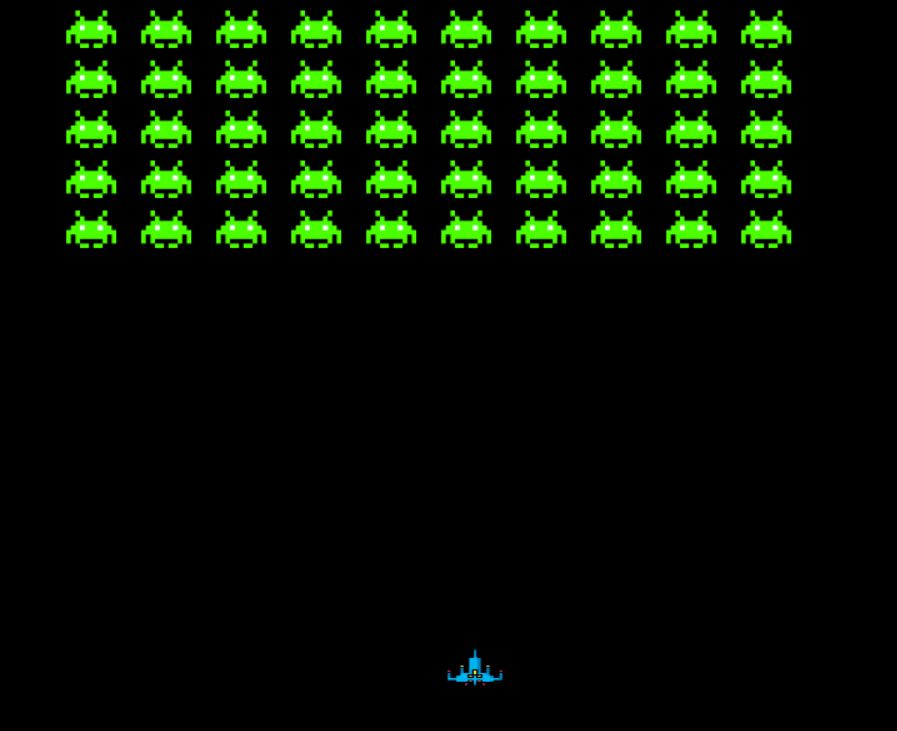

## 👋 hello mars

### Desarrollo "sencillo" de un juego



- entorno

    [crearlo]
    ```bash
    python -m venv mars
    ```

    [activarlo]
    ```bash
    .\mars\Scripts\activate

    ```

    [desactivarlo]
    ```bash
    deactivate
    ```

- install required dependencies

    ```bash
    pip install -r requirements.txt
    ```

    
- creación requirements.txt

    ```bash
    pip freeze > requirements.txt
    ```

